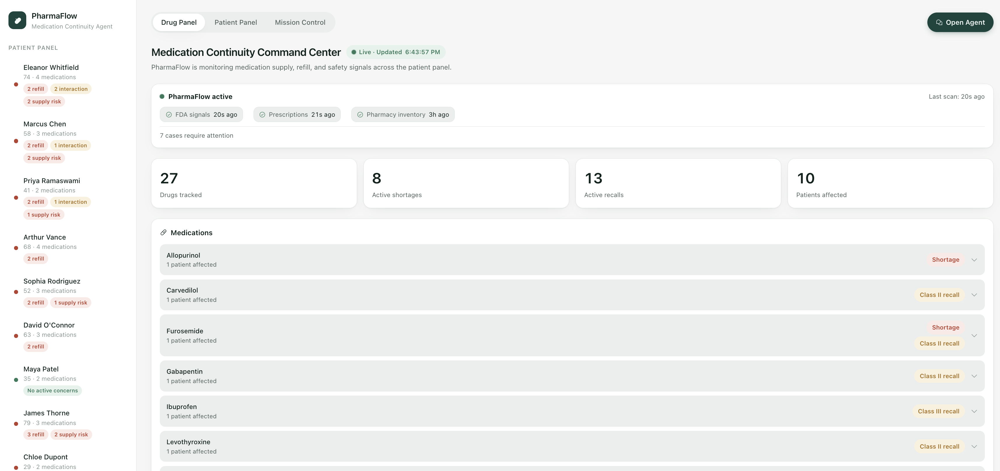
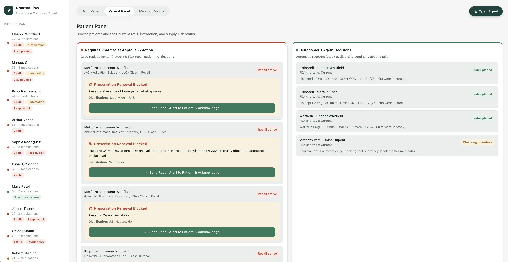
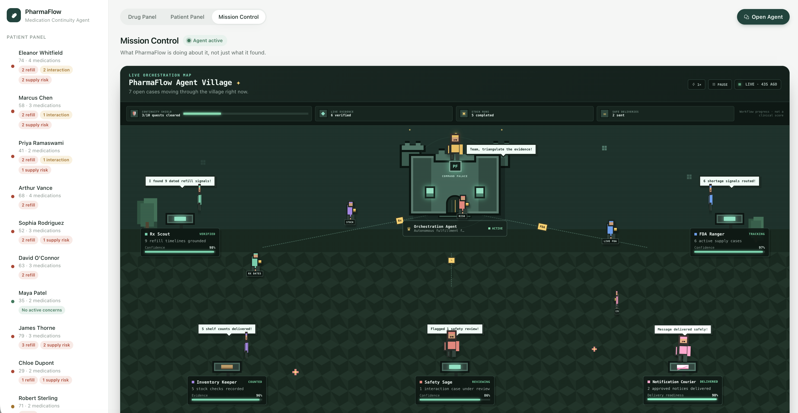

# PharmaFlow — Medication Continuity Agent

PharmaFlow is a medication-continuity command center for care-coordination teams. It combines patient prescriptions, refill timing, interaction risk, pharmacy inventory, FDA shortages, and FDA recalls so teams can find continuity problems before they become crises.

The project is built on [TrueForge](https://github.com/truefoundry/trueforge), the open-source agent harness, for the [Agent Harness Hackathon](https://www.wemakedevs.org/blogs/agent-harness-hackathon-kick-off).

> **Prototype only:** PharmaFlow uses synthetic patient, pharmacy, and interaction data. It is not a clinical decision-support system and must not be used for real medication decisions.

## Product tour

### Drug Panel

The default command-center view groups the patient panel by medication. It shows who takes each drug, active shortage and recall signals, affected patients, and when FDA, prescription, and pharmacy-inventory sources were last checked.



### Patient Panel

The Patient Panel separates work requiring pharmacist approval from actions the agent can safely complete autonomously. Recall alerts can block renewal and prompt a patient notification; in-stock continuity cases can produce a routine same-drug reorder.



### Mission Control — Agent Village

Mission Control turns the workflow into an animated, Minecraft-inspired operations map. Specialist roles carry labeled evidence to the orchestration palace, while workflow achievements summarize cases cleared, live evidence verified, inventory checks completed, and notifications sent.



The map is interactive: select an agent to inspect its purpose and current task, pause the animation, or change its speed. Movement is driven by workflow evidence; for example, the Notification Courier stays at the gate until an approved notification exists.

## Main functionality

- **Medication-centric monitoring:** groups every prescribed drug with affected patients, shortage status, recall status, and expandable evidence.
- **Patient continuity monitoring:** finds overdue and upcoming refills, adherence signals, supply exposure, and drug-drug interaction risk.
- **Live FDA retrieval with an honest fallback:** queries openFDA shortage and enforcement/recall endpoints. If a live endpoint is unavailable, results come from a small demo fixture and retain `source: "demo"` rather than being presented as live.
- **Recall safeguards:** identifies affected patients, blocks prescription renewal for an active recall, and records acknowledgement/notification activity.
- **Inventory-aware fulfillment:** checks synthetic pharmacy inventory before acting. Available stock permits a routine refill of the existing prescription; zero stock routes the case toward an approved alternative workflow.
- **Human approval:** consequential review or alternative-supply actions pause for a pharmacist instead of silently proceeding.
- **Persisted cases and actions:** cases, orders, and notifications live in JSON stores shared by the web backend and MCP tools.
- **Streaming agent chat:** the “Open Agent” drawer streams model responses, tool activity, and approval pauses from TrueForge through Server-Sent Events (SSE).

## How TrueForge is used

PharmaFlow uses TrueForge as the execution harness—not merely as a chat UI.

1. `src/setup-trueforge.mjs` registers the OpenAI model provider, MCP servers, git-backed skills, and the `pharmaflow` agent through the TrueForge REST API.
2. The browser sends a question to the PharmaFlow Express backend.
3. The backend creates or resumes a TrueForge session using `@truefoundry/trueforge-sdk`.
4. TrueForge loads agent instructions and relevant skills, then lets the model discover and call registered MCP tools.
5. Tool results return through TrueForge and stream to the browser as SSE events.
6. If a gated tool is selected, TrueForge pauses the exact turn. The pending approval is persisted on the case, and the browser can approve or reject that same tool call later.

TrueForge provides:

- model and agent registration;
- MCP tool discovery and execution;
- git-backed procedural skills;
- session and turn management;
- streamed model/tool events;
- human approval gates;
- exact paused-turn resumption.

## Agent roles and communication

The current backend runs **one real TrueForge orchestration agent**, named `pharmaflow`. Mission Control visualizes its responsibilities as five specialist roles:

| Visual role | Responsibility | Evidence handed to the orchestrator |
| --- | --- | --- |
| **Rx Scout** | Refill timing and prescription continuity | Refill dates and patient-specific gaps |
| **FDA Ranger** | Shortage and recall retrieval | Live or demo-labeled FDA records |
| **Safety Sage** | Drug-interaction review | Interaction severity and rationale |
| **Inventory Keeper** | Pharmacy stock checks | Available units and reorder readiness |
| **Notification Courier** | Approved patient communication | Persisted simulated delivery records |

These are role-oriented views of one governed agent workflow, not five independent LLM processes. The UI makes responsibilities and handoffs understandable while TrueForge remains the single source of session state, tool execution, and approval control.

### How the roles “talk”

The specialists do not exchange free-form hidden messages. They coordinate through explicit, inspectable artifacts:

```text
Patient/FDA data
      │
      ▼
MCP tool result ──▶ TrueForge turn ──▶ PharmaFlow orchestrator
      │                                      │
      ▼                                      ▼
Shared case/evidence store             next tool or approval
      │                                      │
      └──────────▶ Agent Village ◀───────────┘
```

- MCP results contain retrieved facts.
- Cases preserve evidence, status, fulfillment state, and pending approvals.
- The event log records actual sessions, tool calls, results, and turn completion.
- Agent Village reads the same artifacts to decide which role is active, what it carries, and whether Notification Courier may move.

No medical fact is created solely for the animation.

## Live, synthetic, and demo data

| Data | Source | Labeling |
| --- | --- | --- |
| FDA shortages | openFDA live API, with fixture fallback | `fda_live` or `demo` |
| FDA recalls | openFDA enforcement API, with fixture fallback | `fda_live` or `demo` |
| Patient prescriptions/adherence | `data/patients.json` | synthetic |
| Drug interactions | `data/interactions.json` | synthetic reference table |
| Pharmacy inventory | `data/pharmacy-inventory.json` | synthetic pharmacy inventory |
| Cases | `data/cases.json` | derived and persisted from app detections |
| Orders | `data/orders.json` | persisted simulated actions |
| Notifications | `data/notifications.json` | persisted simulated deliveries |

## Architecture

```text
┌──────────────────────── Browser ────────────────────────┐
│ Drug Panel │ Patient Panel │ Agent Village │ Agent Chat │
└──────────────────────────┬──────────────────────────────┘
                           │ REST + SSE
                           ▼
                  ┌───────────────────┐
                  │ Express backend   │
                  │ src/backend.mjs   │
                  └─────────┬─────────┘
                            │ TrueForge TypeScript SDK
                            ▼
                  ┌───────────────────┐
                  │ TrueForge harness │
                  │ agent: pharmaflow │
                  └──────┬───────┬────┘
                         │       │
                    MCP HTTP     │ git-backed skills
                         │       │
             ┌───────────┴───┐   └────────────────────────┐
             ▼               ▼                            ▼
┌────────────────────┐ ┌─────────────────────┐ ┌────────────────────────┐
│ PharmaFlow MCP     │ │ FDA MCP             │ │ medication-continuity  │
│ patients/cases/    │ │ shortages/recalls   │ │ shortage-analysis      │
│ inventory/actions  │ │ openFDA + fallback  │ │ medication-fulfillment │
└─────────┬──────────┘ └──────────┬──────────┘ └────────────────────────┘
          │                       │
          ▼                       ▼
  Shared JSON stores          api.fda.gov
```

Both the REST dashboard and MCP server use the same stores. An action performed through an MCP tool is visible in the UI without creating a second mocked state.

## Safety and approval model

The agent can retrieve and summarize data freely. Actions are separated by consequence:

- A same-drug refill from available pharmacy stock is a routine fulfillment action.
- A drug alternative or pharmacist-review action requires explicit human approval.
- Recall acknowledgement and patient notifications remain clearly labeled as simulated.
- A rejected approval reopens the case; it never silently marks the issue resolved.

```text
DETECTED ──▶ INVESTIGATING ──┬──▶ ROUTINE REORDER ──▶ RESOLVED
                             │
                             └──▶ APPROVAL REQUIRED
                                      │
                           ┌──────────┴──────────┐
                           ▼                     ▼
                       APPROVED              REJECTED
                           │                     │
                           ▼                     ▼
                       RESOLVED              DETECTED
```

## Run locally

Requires Node.js 22 or newer and a real OpenAI API key for agent chat.

```bash
npm install
cp .env.example .env
# Add OPENAI_API_KEY to .env
```

Run each service in its own terminal:

```bash
# Terminal 1 — TrueForge
npx @truefoundry/trueforge@latest

# Terminal 2 — patient, case, inventory, and action tools
npm run mcp

# Terminal 3 — FDA tools
npm run fda-mcp

# Terminal 4 — register/update TrueForge resources, then serve the app
npm run setup
npm run backend
```

Open:

- PharmaFlow: [http://localhost:8787](http://localhost:8787)
- TrueForge: [http://localhost:8790](http://localhost:8790)

`npm run setup` is idempotent: rerunning it updates existing resources instead of duplicating them. There is no frontend compilation step; the dashboard is plain HTML, CSS, and JavaScript served by Express.

## Tests

```bash
npm test
```

The project currently has **78 tests** using Node’s built-in test runner. Coverage includes:

- refill timing and boundary conditions;
- case creation, deduplication, reconciliation, and resolution;
- inventory, alternatives, orders, and notification persistence;
- openFDA shortage and recall normalization;
- live-API failure and explicitly labeled demo fallback;
- interaction matching and false-positive avoidance;
- TrueForge streamed tool-call accumulation and `call_tool` unwrapping;
- tool telemetry and event-log behavior.

## Project layout

```text
data/                          synthetic patient, interaction, inventory, and persisted workflow data
docs/screenshots/              product screenshots used in this README
skills/medication-continuity/  refill, interaction, adherence, and escalation procedure
skills/shortage-analysis/      FDA shortage analysis and substitution guardrails
skills/medication-fulfillment/ inventory-first fulfillment procedure
src/backend.mjs                dashboard REST API and TrueForge SSE bridge
src/mcp-server.mjs             patient, case, inventory, and action MCP tools
src/fda-mcp-server.mjs         shortage and recall MCP tools
src/fda.mjs                    live openFDA retrieval and demo fallback
src/store.mjs                  patient/refill/adherence shared data layer
src/cases.mjs                  persisted case lifecycle
src/recalls.mjs                recall alert and acknowledgement store
src/pharmacy-inventory.mjs     synthetic stock and approved-alternative lookup
src/fulfillment.mjs            simulated order and notification persistence
src/setup-trueforge.mjs        idempotent TrueForge resource registration
web/                           no-build dashboard UI
test/                          node:test suites
```

## TrueForge integration notes

Two runtime details were validated against the live harness:

- TrueForge may route a domain tool through its `call_tool` meta-tool (`mcp_server`, `tool_name`, `input`). `src/tool-call-accumulator.mjs` recognizes direct and wrapped tool calls.
- Resuming an approval uses camelCase turn identifiers (`threadId`, `toolCallId`). Pending identifiers are persisted on the case so approval survives a browser or backend restart.

## Current limitations

- Patient, interaction, and pharmacy data are synthetic.
- The fallback FDA fixtures are intentionally small.
- Orders and patient notifications are persisted simulations, not external pharmacy or messaging integrations.
- Agent Village represents specialist responsibilities within one TrueForge agent; independently deployed specialist agents are a future extension.
- A valid `OPENAI_API_KEY` is required for model responses.

## Qodo Code Review Evidence

Qodo is connected to this GitHub repo and reviews every pull request automatically.

- **[PR #1 — initial feature PR](https://github.com/ramyavelaga9/pharmaflow/pull/1):** Qodo flagged [9 real bugs](https://github.com/ramyavelaga9/pharmaflow/pull/1#issuecomment-5464387784) (6 high, 3 medium) — a refill look-ahead window that silently dropped medications due 8–14 days out, an unsynchronized concurrent write that could drop a dose log, a UTC-midnight boundary bug that flipped refill urgency mid-day, misordered FDA fallback data, a duplicate-polling-interval leak in Mission Control, a REST endpoint that coerced malformed dose values instead of rejecting them, a brand-name drug search that could never match, a setup script that stripped previously registered skills on rerun, and a UI race that could render a stale patient onto a newer selection. The PR merged with these unresolved.
- **[PR #4 — fix + review PR](https://github.com/ramyavelaga9/pharmaflow/pull/4):** fixed all 9 findings above and re-ran Qodo review after every commit, since each fix pass itself surfaced further, genuinely valid issues (all in the newly added `patients.json` cross-process lock, the hardest piece of this fix set):
  1. Fixed the original 9 findings → Qodo's re-review found **4 new issues** in the fix itself (a live-only URL that queried the wrong openFDA field, a broadened brand-match that could fabricate a shortage on a clean live no-match, no crash-recovery for an orphaned lock file, and a same-patient race the first stale-response fix missed).
  2. Fixed those 4 → Qodo found **2 more** (the stale-lock reclaim could steal a lock still held by a live-but-slow process; a live record matched by `proprietary_name` was being filtered back out).
  3. Fixed those 2 → Qodo found **1 more**, a real TOCTOU-class defect (a heartbeat writing by pathname could resurrect ownership over a lock another process had already reclaimed and replaced).
  4. Rather than patch that a fifth time, replaced the hand-rolled lock with [`proper-lockfile`](https://www.npmjs.com/package/proper-lockfile), a mature, independently tested library built to solve exactly this class of problem → Qodo found **1 more** (a custom `onCompromised` handler logged and continued instead of stopping the in-flight write).
  5. Added an explicit abort checkpoint immediately before the write → **Qodo reported 0 bugs.**

  Every round added regression tests for the fix it introduced; the suite grew from 78 to 88 tests, all passing. The commit history on PR #4 is the full, real review-and-fix loop, including the two intermediate escalations (adding a crash-recovery heartbeat, then switching to a proven library) that a purely reactive, single-pass fix would have missed.
